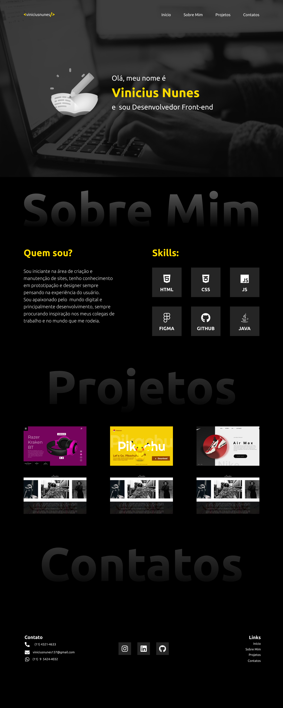

# **PORTIFÓLIO VINICIUS NUNES - 2022**

## [Clique aqui](https://viniciusnunes137.github.io/portifolio/) para acessar o site

## **SOBRE**

- Site tipo do portifólio, onde foi construído com o intuito de divulgar a minha evolução como desenvolvedor web.

- - Foi proposto esse projeto pelo professor de Linguagem de Marcação com a finalidade de replicar um projeto que desenvolvemos no FIGMA com a finalidade de compreender a @media para responsividade.

## **TECNOLOGIAS APLICADAS**

- HTML5
- CSS3

## **FERRAMENTAS**

- VSCODE
- GITHUB / GIT
- FIGMA
- FONT-AWESOME

## **CONCEITOS APLICADOS**

- DISPLAY (GRID)
- GRID (AREA)
- CSS PORCIONADO
- @MEDIA

## **AUTOR**

- [VINICIUS NUNES](https://github.com/VINICIUSNUNES137)

